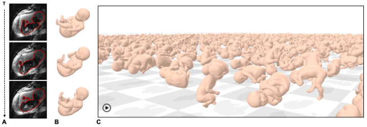

# Fetuses Made Simple

<div align="center">
  
</div>

**Fetuses Made Simple: Modeling and Tracking of Fetal Shape and Pose**
<br />
Yingcheng Liu,
Peiqi Wang,
Sebastian Diaz,
Benjamin Billot,
Esra Abaci Turk,
Ellen Grant,
Polina Golland
<br />
International Conference on Medical Image Computing and Computer Assisted Intervention (MICCAI), 2025.
<br />
[[Paper]](https://arxiv.org/abs/2506.17858)
[[Project Page]]()
[[BibTex]]()

## Environment Setup

The code is developed on `Python 3.9`. We recommend using conda/mamba to handle environments and dependencies.

```bash
mamba create -n fetal_smpl_39 python=3.9
mamba activate fetal_smpl_39
mamba install numpy==1.26.4 scikit-image==0.19.3
mamba install joblib tqdm einops
mamba install pytorch==1.13.0 torchvision==0.14.0 torchaudio==0.13.0 pytorch-cuda=11.7 -c pytorch -c nvidia
mamba install pytorch3d -c pytorch3d
mamba install nibabel pandas openpyxl
mamba install tensorboard
pip install smplx
pip install git+https://github.com/jonbarron/robust_loss_pytorch
pip install aitviewer
```

The most triky part is to install `pytorch3d`. 
If you encounter issues, please refer to the [pytorch3d installation guide](https://pytorch3d.org/docs/installation). 
Newer python may not be compatible with `pytorch3d`, so we recommend using `Python 3.9`.

To use `smplx` package, please download the SMPL-X model files: [model loading](https://github.com/vchoutas/smplx#model-loading).
After downloading the files, model directory may look like this:
```
models
├── smil_pose_prior_converted_mean.npy
├── smil_pose_prior_converted_prec.npy
└── smpl
   ├── SMPL_FEMALE.pkl -> /data/vision/polina/users/liuyingcheng/storage/data/fetal-pose/smplx/converted_models/basicModel_f_lbs_10_207_0_v1.0.0.pkl
   ├── SMPL_INFANT.pkl -> /data/vision/polina/users/liuyingcheng/storage/data/fetal-pose/smplx/converted_models/smil_web.pkl
   └── SMPL_MALE.pkl -> /data/vision/polina/users/liuyingcheng/storage/data/fetal-pose/smplx/converted_models/basicmodel_m_lbs_10_207_0_v1.0.0.pkl
```

We used [aitviewer](https://github.com/eth-ait/aitviewer) to visualize the results.

## Usage

We included one time series data (segmentation and pose) in the `results` folder for demonstration purpose.
We align both infant/fetal SMPL model to this example time series in following steps.

### Align model to segmentation and keypoints

Change PYTHONPATH and EXP_DIR to your working directory
```bash 
export PYTHONPATH=/data/vision/polina/scratch/liuyingcheng/code/fetal_pose/fetal-smpl:$PYTHONPATH
export FOLD="open_source"
export EXP_DIR="/data/vision/polina/scratch/liuyingcheng/code/fetal_pose/fetal-smpl/results/${FOLD}"
export FOLDER_NAME="visualization"
```

This aligns infant SMPL (SMIL) model to example segmentation and keypoints
```bash 
python scripts/fetal_smpl_align.py \
  --exp-dir "${EXP_DIR}" \
  --data-split "${FOLD}" \
  --folder-name "${FOLDER_NAME}" \
  --step-idx 0 \
  --num-beta 10 \
  --runner local
```

This aligns fetal SMPL model to example segmentation and keypoints
```bash 
python scripts/fetal_smpl_align.py \
  --exp-dir "${EXP_DIR}" \
  --data-split "${FOLD}" \
  --folder-name "${FOLDER_NAME}" \
  --step-idx 1 \
  --num-beta 10 \
  --runner local
```

### Visualization

**Visualize aligning model to segmentation and keypoints.**
```bash
python scripts/visualization/init_align_smil_to_posed_optim_his.py \
--data_dir ./results/open_source/data/visualization \
--exp_dir ./results/open_source/evaluation/model_1/num_betas_10/visualization \
--subj_name MAP-C507 \
--frame_idx_list 0,10,20,30 \
--fetal_smpl_data_dict_path ./results/open_source/training/model/step_1.npy
```
https://github.com/user-attachments/assets/61e097cc-766c-40a3-a8e5-8d030fc45ea2

**Animate aligned model.**
```bash
python scripts/visualization/init_align_smil_to_posed_seq.py \
--exp_dir ./results/open_source/evaluation/model_1/num_betas_10/visualization \
--subj_name MAP-C507 \
--num_betas 10 \
--fetal_smpl_data_dict_path ./results/open_source/training/model/step_1.npy
```
https://github.com/user-attachments/assets/af4c0880-b5db-4f4c-9d59-2463d361601a

**Visualize aligning model to unposed segmentation (canonical shape estimation).**
```bash
python scripts/visualization/init_smil_beta_from_unposed_history.py \
--exp_dir ./results/open_source/evaluation/model_1/num_betas_10/visualization \
--subj_name MAP-C507 \
--fetal_smpl_data_dict_path ./results/open_source/training/model/step_1.npy
```
https://github.com/user-attachments/assets/5b415b52-d49e-4bcb-a363-235d58b15b2f

**Align canonical shape to segmentation and keypoints.**
```bash
python scripts/visualization/align_subj_spec_shape_seq.py \
--exp_dir ./results/open_source/evaluation/model_1/num_betas_10/visualization  \
--step_idx 1 
```
https://github.com/user-attachments/assets/8723d557-e968-402e-926f-466654869e4b

**Animate aligned canonical shape.**
```bash
python scripts/visualization/align_subj_spec_shape_optim_his.py \
--data_dir ./results/open_source/data/visualization \
--exp_dir ./results/open_source/evaluation/model_1/num_betas_10/visualization \
--subj_name MAP-C507 \
--step_idx 1 \
--frame_idx_list 0,4,8,12  
```
https://github.com/user-attachments/assets/57c4f669-dae7-4a24-8624-3264eeb8a9e9

To run the above steps using infant SMPL model, change `model_1` to `model_0` in the command line arguments. 
And remove `--fetal_smpl_data_dict_path` argument.

## License

This project is licensed under the MIT License.

## Contact

Email: liuyc@mit.edu
